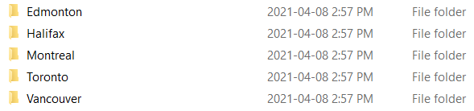
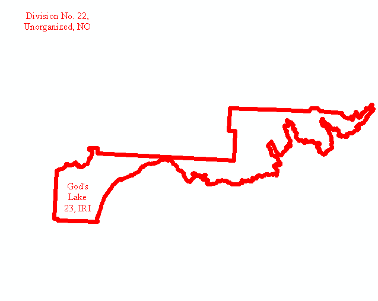

# New cb Geometry Mapping

## Description

This project adds in new cb geometry and labels under the old cb geometry so that any changes are clearly visible. The changed maps can then be saved to a pdf using the pdf saver script provided. This project was created using python 2.7 and arcmap 10.6.

## Process

## File Structure

While this does not have to be exact the folder structure used to get the best results for this project was as follows

All folders should be empty at the beginning of the project and GMS zips should be placed in the zips folder.
All files extracted from the zips should be placed in the extracted folder
All files augmented by the augment_maps.py script should be placed in the aug folder
All zip files containing augmented maps should be placed in the aug_zips folder 
All PDF files should be placed in the pdfs folder hich should be contricted like below (further explanation in the mxd_to_pdf.py section of this doc
)

### Data Prep and Processing

As this project takes maps that have been output by GMS please only use maps that are the final output as the added data here will not be maintained after being run through GMS again. There is only one major preprocessing step for this project and that is to setup the symbology layer that will be used in all the maps. To do this open the new cb geometry layer in arcmap and make the changes so that it fits as desired. Save this as a .lyr file in an accessable directory. 

### extract_all_zips.py

Takes all zip files in a directory and extracts their contents into a directory of the users choosing.

### augment_maps.py

This script adds the new cb layer and applies the symbology from the symbology guide lyr file. The augmented map is saved with its updated mdb in a directory of the users choosing.

### zip_mxds.py

If the desired output is the augmented GMS maps then this script will zip the outputs into their own .zip files to allow for better portability. Takes all mxd’s and their associated mdb’s contained in a directory and creates a zip containing only the mxd and mdb for each map. All outputs are placed into a single dedicated out directory.

### mxd_to_pdf.py

If the desired output is a pdf instead of a zipped mxd / mdb pair then run this script with the input as the directory of the imported maps. The directory must contain folders names like the image below

The output directory must be organized like this because the script determines the files outpath by looking at this dectionary:
    
    destination_dict = {'10': 'Halifax',
                        '11': 'Halifax',
                        '12': 'Halifax',
                        '13': 'Halifax',
                        '24': 'Montreal',
                        '35': 'Toronto',
                        '46': 'Edmonton',
                        '47': 'Edmonton',
                        '48': 'Edmonton',
                        '59': 'Vancouver',
                        '60': 'Vancouver',
                        '61': 'Edmonton',
                        '62': 'Edmonton'} 

The numbers are the province code for the mxd and the city is the destination city the map will be sent to for distrbution.