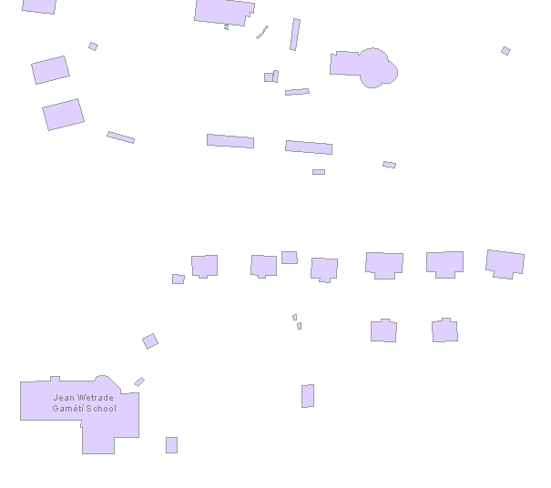
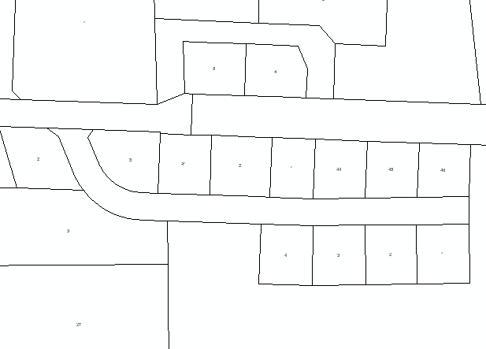
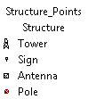
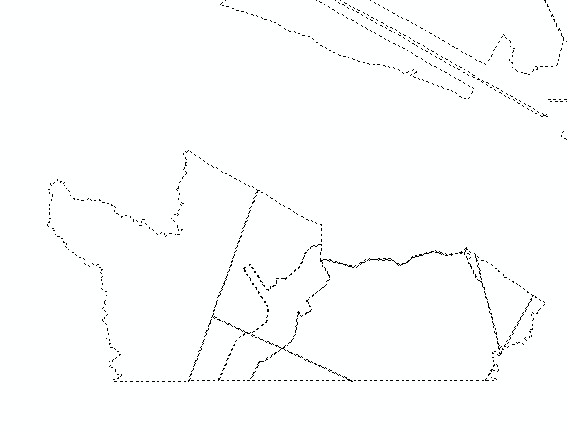

# NT ATLAS Maps

## Description

This project took maps output by GMS and applied open data layers from the NWT ATLAS to enhance
map readability by giving field staff more points of reference These enhancements were done using  
open data to mirror similar maps produced by NWT.In order to do the enhancements a process was 
developed using python using arcpy which would makethe enhancements and save an enhanced copy 
in a new directory.

## Process

As this project uses arcmap all scripting is done in python 2.7. Below is a brief description of each step
and file in the process.

### Data Prep and Preprocessing

There are several steps that must be completed before running the process. First all enhancement data
needs to be downloaded from the NWT ATLAS. The ATLAS viewer can be located here and all layerrs are available 
for free download: https://www.maps.geomatics.gov.nt.ca/HTML5Viewer_Prod/index.html?viewer=ATLAS  

The specific layers to download for this project are. Ensure that you select the entire territory for best
coverage in augmenting maps:
    
- Building Footprints
- Surveyed Parcels
- Transportation Polygons (specifically for airstrips)
- Structure Points
- Unsurveyed Tenured Commissioners Land

The other data source used to imporve the maps was address point data sourced from the city of yellowknife
which can be found at the following link: 

https://opendata.yellowknife.ca/home/details/92407f76-6c52-449a-a4c3-01fbdc3b30ff

if the link is broken the data is found in the open data section of the site under civic addresses and is a
point file. For the purposes of the script it is best to download the file geodatabase version of the file.

Once the data is downloaded layer specific symbology and labeling symbology needs to be applied. To do this 
open an empty arcmap session to be a layer workspace and add the ATLAS layers to the data frame.

#### Layer symbology guide

Below are some quick notes on how the the layers were symbolized for this iteration of the project

##### Building Footprints

Sybolized with a purple fill (CMYK: ) and a black outline (CMYK: ). Named buildings are labeld in grey 
(CMYK: ) with their name from the name_e field

##### Surveyed Parcels

Symbolized with a hollow fill and a solid black outline. Parcels are labeled by parcel number in areas where 
the yellowknife addresspoints are visible the labels should be turned off so as to avoid confusion.

##### Transportation Polygons (specifically for airstrips)

With a definition query selecting only runways to be visible. The polygons are dark brown (CMYK: ) and unlabeled

##### Structure Points

Symbolized with a symbology taken from the NWT maps this layer shows certain key strucutre point as shown in the legend below.

##### Unsurveyed Tenured Commissioners Land

Apply the desired symbology and label settings to each ATLAS layer and any of the standard GMS layers
as needed. Export each layer as a .lyr file into the same folder.

Once all preperations are complete you can input the paths to the correct folders and files into the variables
in the inputs section of the project scripts 

### extract_all_zips.py

MXD's received from GMS were received as zip files this script contains a function that
unzips the contents of a zip and puts all outputs into a single folder.

#### Inputs

- in_path: directory location of the GMS zip files. 
- out_path: directory location to place the mxd and mdb files extracted from the GMS zips

### augment_maps.py

The main augmentation script and takes unzipped mxd and mdb files from a single folder. Iterates over
all map documents in the specified folder and outputs an augmented copy in a new folder with an
updated copy of the associated mdb.

#### Inputs

- working_directory: Directory containing the extracted mxd's and mdb's
- out_directory: The path to the directory where the augmented maps will be placed
- workingGDB: The path to the gdb containing the feature classes that will be used to augment the map
- work_folder: path to the folder containing the .lyr files that will be used to apply lyr specific symbology and labeling to the map
- ***_symb_lyr: each one of these should point to a specific symbology lyr file that will be used to apply labels and symbology for that layer to the map
- symb_lyr_basepath: The path to the folder containing .lyr files with new symbologies for the base gms layers
- ***_lyr_base_symb_change: a list object that containes the paths to all the .lyr files in the symb_lyr_basepath folder
- ATLAS_gdb: the path to the gdb that holds the layers downloaded from the NWT ATLAS that will be used to augment the maps
yk_adp_GDB: Path to the gdb that contains the featureclass of yellowknife address points
yk_adp_fc: complete path to the wyellowknife address points feature class

### zip_mxds.py

Takes all mxd’s and their associated mdb’s contained in a directory and creates a zip containing only the mxd 
and mdb for each map. All outputs are placed into a single dedicated out directory.

#### Inputs 

- working_dir: Path to direcory where augmented files were placed
- out_folder: Path to desired ouput directory
